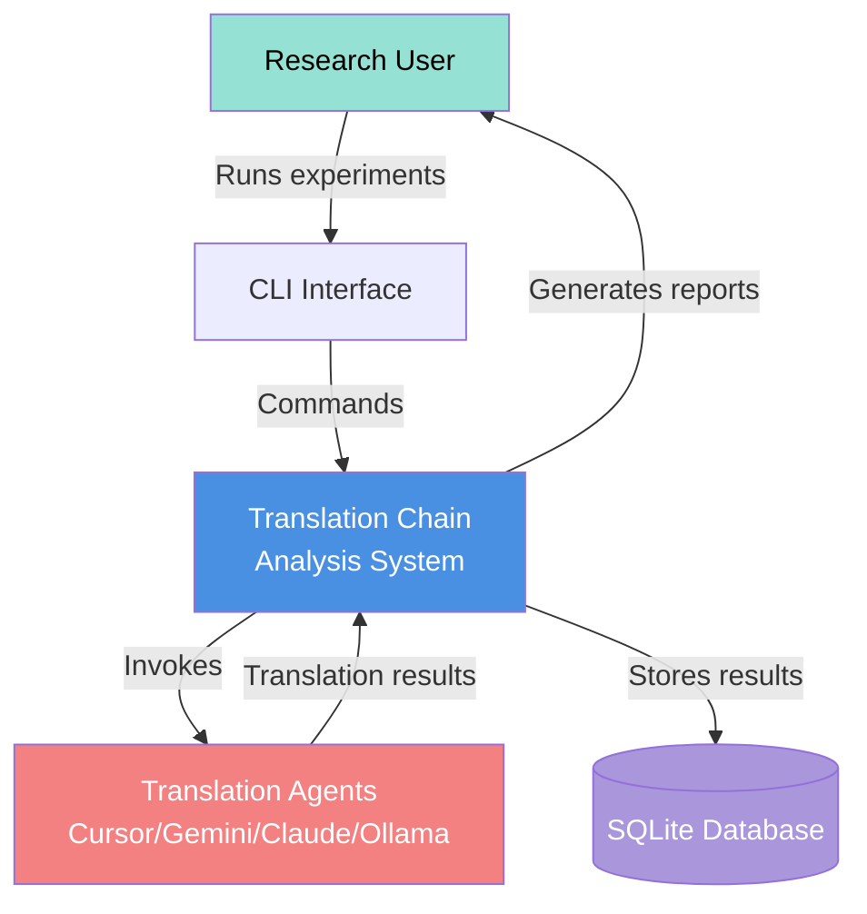

# C4 Context Diagram

## System Context: Translation Chain Vector Distance Analysis

## Actors

- **Research User**: Investigator studying translation quality degradation
- **Translation Agents**: External CLI tools (cursor-agent, gemini, claude, ollama)
- **SQLite Database**: Persistent storage for experimental results

## System Boundary

The system orchestrates multi-stage translations, injects controlled errors, computes vector embeddings, calculates semantic distances, and provides statistical analysis capabilities.

