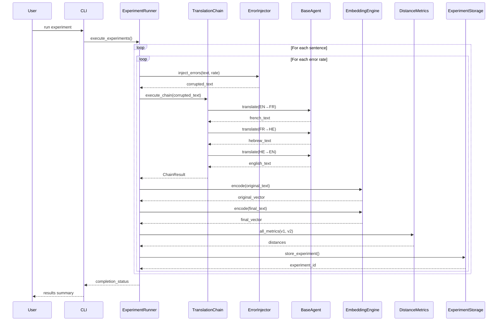

# Component Interaction Diagram

## Translation Chain Execution Flow

## Key Interactions

1. **Error Injection**: Controlled corruption of input text
2. **Translation Chain**: Three-stage translation pipeline
3. **Embedding Generation**: Sentence-BERT vector encoding
4. **Distance Calculation**: Cosine, Euclidean, Manhattan metrics
5. **Persistent Storage**: Results saved to SQLite database

