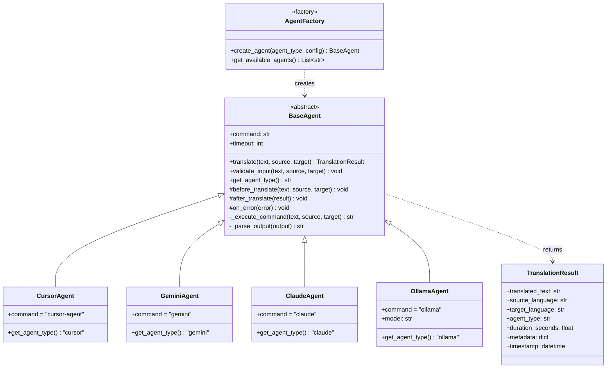

# Plugin Architecture Diagram

## Agent Plugin System



## Plugin Architecture Benefits

1. **Extensibility**: New agents added by subclassing `BaseAgent`
2. **Consistency**: Common interface ensures uniform behavior
3. **Lifecycle Hooks**: `before_translate`, `after_translate`, `on_error`
4. **Factory Pattern**: Centralized agent instantiation
5. **Configuration**: Agent-specific settings via config

## Adding a New Agent

```python
from src.agents.base import BaseAgent, TranslationResult

class MyCustomAgent(BaseAgent):
    def __init__(self, command="my-agent", **kwargs):
        super().__init__(command, **kwargs)
    
    def get_agent_type(self) -> str:
        return "custom"
    
    # Optional: Override hooks
    def before_translate(self, text, source, target):
        print(f"Translating {source} → {target}")
```

Register in `AgentFactory`:

```python
# src/agents/factory.py
AGENT_CLASSES = {
    'cursor': CursorAgent,
    'gemini': GeminiAgent,
    'claude': ClaudeAgent,
    'ollama': OllamaAgent,
    'custom': MyCustomAgent  # Add here
}
```

